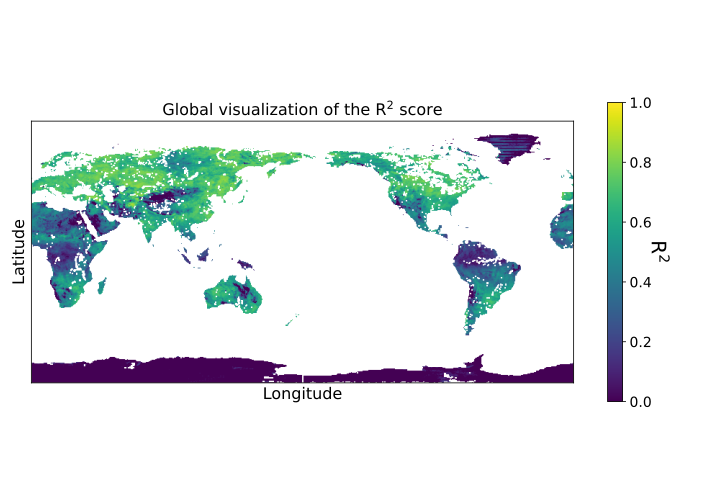
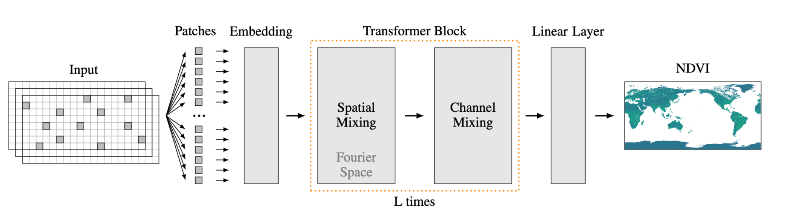

This repository contains the code for our paper "Global Vegetation Modeling With Pre-Trained Weather Transformers".

## Abstract
Accurate vegetation models can produce further insights into the complex interaction between vegetation activity and ecosystem processes. 
Previous research has established that long-term trends and short-term variability of temperature and precipitation affect vegetation activity.
Motivated by the recent success of Transformer-based Deep Learning models for medium-range weather forecasting, we adapt the publicly available pre-trained FourCastNet to model vegetation activity while accounting for the short-term dynamics of climate variability. 
We investigate how the learned global representation of the atmosphere’s state can be transferred to model the normalized difference vegetation index (NDVI).
Our model globally estimates vegetation activity at a resolution of 0.25° while relying only on meteorological data.
We demonstrate that leveraging pre-trained weather models improves the NDVI estimates compared to learning an NDVI model from scratch.
Additionally, we compare our results to other recent data-driven NDVI modeling approaches from machine learning and ecology literature.
We further provide experimental evidence on how much data and training time is necessary to turn FourCastNet into an effective vegetation model. 

The repository, data processing and training code is based on the [FourCastNet repository](https://github.com/NVlabs/FourCastNet/tree/master).

## Data preparation
To download the weather data, create an account at CDS and install the cdsapi package. 
Then run the respective scripts from the `copernicus` folder.
After the download, run the `parallel_copy_daily` script to prepare the data for training (note that it can be run in parallel by processing a subset of the years via separate `args` calls).
In all above, set your paths accordingly.

## Training
Training configuration is managed in the `config` folder, in the file `AFNO.yaml`.
Here, you can set (some) hyperparameters, and the data paths.
To train the model, run the `train.py` script.

## Hyperparameter search
For the baseline CNN, we conducted a hyperparameter search.
Note that we used [Weights & Biases Sweeps](https://docs.wandb.ai/guides/sweeps), so you might need to create an account with `wandb` and set up the API key.
To start a new sweep, go to the `sweep` folder and run the `start_sweep_cnn.py` script.
To start a single agent, run the `hparam_search_train.py` script on your compute infrastructure.

## Evaluation
To evaluate the trained model, run the `inference_global_visualization.py` script, passing the paths to the trained model and the masks.

## FourCastNet
